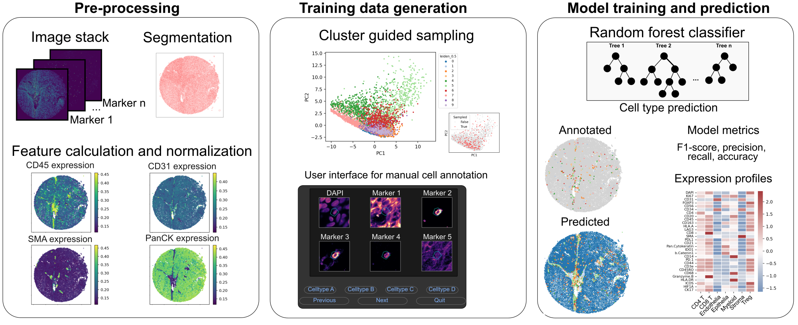

# Fluoro-forest
A semi-supervised machine learning worfklow for cell type prediction in high plex immunofluorescence data.

Dryad submission for data downloads to run the example predictions:
link. 

requires, _expression.tsv and .ome.tif files, which should be moved into example_data folders:

├── anal_cancer
   ├── processed
   │   ├── C-7.ome.tif
   │   └── N-12.ome.tif
   ├── raw
   │   └── channelnames.txt
   ├── segmentations
   │   ├── C-7.geojson
   │   └── N-12.geojson
   ├── summaries
   │   ├── C-7_coords.csv
   │   ├── C-7_expression.csv
   │   ├── N-12_coords.csv
   │   └── N-12_expression.csv
   └── temp_annotations
       ├── C7_annotations.csv
       └── N12_annotations.csv

